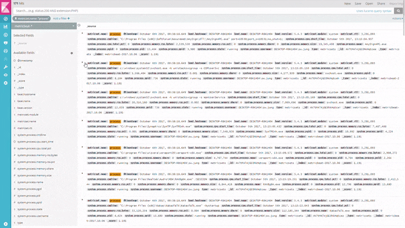

# markdown_doc_view

A plugin for custom doc view using markdown+handlebars template.



---

## Features

### New Doc View "Markdown"

You can use the new doc view named "Markdown" in discover and dashboard's search panel.

It's based on custom template using [markdown](https://markdown-it.github.io) and [handlebars](http://handlebarsjs.com).

In kibana's management page, you can manage templates for each index patterns.

## Installation

Copy installation file's url as same version of your kibana from [the repository releases](https://github.com/sw-jung/kibana_markdown_doc_view/releases).

And
```bash
$ cd path/to/your/kibana
$ bin/kibana-plugin install <installation file's url>
```

 If you want more information, See [this document](https://www.elastic.co/guide/en/kibana/current/_installing_plugins.html).

> **NOTE: How can I do if I cannot find version I want?**  
> I'm sorry for that. This plugin not all of kibana versions are supported.  
> If you need unsupported version, please test nearest version.  
> In this case, you need to modify the kibana.version field in package.json.  
> **Currently minimum support version is v5.5.0**

## Configuration

The following configurable options are set by default.

### kibana.yml

```yml
markdown_doc_view:
  enabled: true
```

## development

See the [kibana contributing guide](https://github.com/elastic/kibana/blob/master/CONTRIBUTING.md) for instructions setting up your development environment. Once you have completed that, use the following npm tasks.

  - `npm start`

    Start kibana and have it include this plugin

  - `npm start -- --config kibana.yml`

    You can pass any argument that you would normally send to `bin/kibana` by putting them after `--` when running `npm start`

  - `npm run build`

    Build a distributable archive

  - `npm run test:browser`

    Run the browser tests in a real web browser

  - `npm run test:server`

    Run the server tests using mocha

For more information about any of these commands run `npm run ${task} -- --help`.